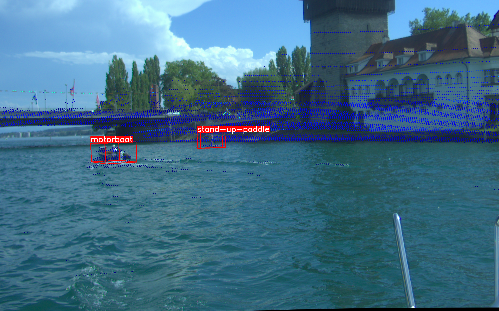

# Lake Constance Obstacle Detection Benchmark

This repository contains the baseline and the evaluation metric for the Lake Constance Obstacle Detection Data-set. 

#### Read data from hdf5 files with h5py
We provide a jupyter-notebook (read_hdf5.ipynb) which describes how the data can be read out using h5py.


#### mAP3D metric
This is basically a copy of the mAP metric from [torchmetrics](https://lightning.ai/docs/torchmetrics/stable/detection/mean_average_precision.html). It uses [pycocotools](https://pypi.org/project/pycocotools/) which is a fork of the orginal cocoapi. To measure the Intersection over Union of arbitrarily rotated bounding boxes we integrated the IoU3D computation from [pytorch3D](https://pytorch3d.org/).

##### Install and test the metric
```bash
cd mAP3D
python3 install setup.py
python3 test_evaluation.py
```

#### Train your own Faster R-CNN model
1. Download and extract the data-set (DOI: 10.48606/112)
2. Extract images and annotations from hdf5 files
```bash
cd nn/utils
python3 extract_data.py --dataset_path <PATH_TO_DATA-SET> --target_path <PATH_TO_STORE_NEW_DATA>
```
3. Train the model
```bash
cd nn
python3 train_faster_rcnn.py --log_path <PATH_TO_SAVE_LOG_FILES> --dataset_path <PATH_TO_STORE_NEW_DATA>
```
4. Evaluate the best model on test-set
Use faster_rcnn_eval.ipynb (adjust the paths) in the nn/evaluation directory

#### Evaluate your model with the 3d detection baseline
Set the path to your new trained model in lidar_evaluation.ipynb and run the cells.


## Citation

```bibtex
@INPROCEEDINGS{griesser2024enhancing,
  author={Griesser, Dennis and Franz, Matthias O. and Umlauf, Georg},
  booktitle={2024 IEEE International Conference on Robotics and Automation (ICRA)}, 
  title={Enhancing Inland Water Safety: The Lake Constance Obstacle Detection Benchmark}, 
  year={2024},
  volume={},
  number={},
  pages={14808-14814},
  doi={110.1109/ICRA57147.2024.10610600}
}
```

